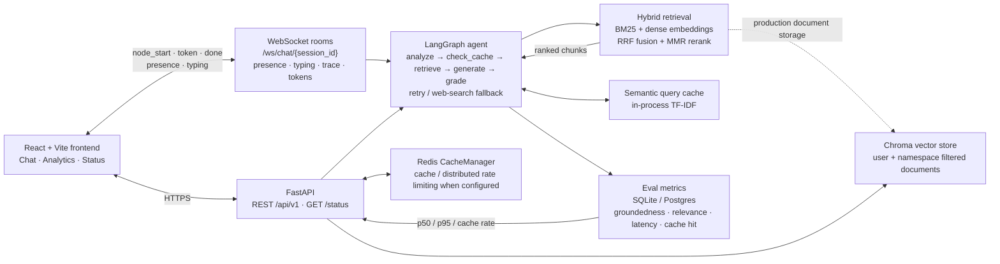

# NeuralRAG Enterprise Platform

> **Live demo:** [https://YOUR-DEPLOYED-DEMO-URL.example](https://YOUR-DEPLOYED-DEMO-URL.example) *(replace this placeholder after deployment)*

<!-- DEMO_MEDIA: Replace this comment with a short embedded GIF or MP4 once recorded. -->

## Architecture



The observable WebSocket agent uses the hybrid retrieval path above. The
authenticated production chat pipeline currently queries Chroma directly; both
paths keep source metadata and feed the same evaluation/status telemetry.

## Recording the demo media placeholder

Run the backend and frontend in two terminals, then record a short 15–30 second
session that opens `/live-demo`, sends a question, and shows the live trace.

```bash
# terminal 1
cd backend && python -m uvicorn app.main_demo:app --port 8000

# terminal 2
cd frontend && npm run dev

# Windows screen capture to MP4 (adjust desktop or crop arguments as needed)
ffmpeg -f gdigrab -framerate 30 -i desktop -t 20 docs/demo.mp4

# Optional terminal-only companion recording, then GIF conversion
asciinema rec docs/demo.cast
agg docs/demo.cast docs/demo-terminal.gif
```

Replace `DEMO_MEDIA` above with `` or a
hosted MP4 link once you have recorded it.

[](https://github.com/OWNER/REPOSITORY/actions/workflows/ci.yml)

> Replace `OWNER/REPOSITORY` in the badge URL after publishing the repository to GitHub.

Full-stack RAG (Retrieval-Augmented Generation) document intelligence platform.
LangChain + LangGraph agent backend, FastAPI API, React/Vite frontend.

## Status of this build

This folder is the actual, compiled, verified version of the project generated in our
conversation, with real bugs found and fixed along the way:

| # | File | Bug | Fix |
|---|---|---|---|
| 1 | frontend/src/pages/AnalyticsPage.jsx | Unescaped apostrophe in `'Today's Queries'` broke JSX parsing | Switched to double quotes |
| 2 | frontend/src/index.js | JSX inside a `.js` file rejected by Vite/esbuild | Renamed to `index.jsx` |
| 3 | frontend/src/pages/DocumentsPage.jsx | Imported nonexistent `CloudUpload` from lucide-react | Corrected to `UploadCloud` |
| 4 | frontend/src/store/authStore.js | `isAuthenticated` never set true on rehydration | Added `isHydrated` flag + `onRehydrateStorage` callback |
| 5 | frontend/src/App.jsx | Race condition: direct/refreshed loads of protected routes (`/chat`, `/documents`, etc.) bounced to `/login` then redirected to `/dashboard` regardless of the requested URL | `PrivateRoute`/`PublicRoute` now wait for `isHydrated` before redirecting; added splash screen for the gap |
| 6 | backend/requirements.txt | `pydantic.EmailStr` used in schemas.py but `email-validator` was never listed as a dependency — would crash on startup | Added `pydantic[email]` to requirements.txt |
| 7 | backend/requirements.txt | The pinned LangChain 0.1.0 family required incompatible `langsmith` ranges, so a clean production install failed with `ResolutionImpossible` | Pinned a compatible LangChain 0.1.9 / Core 0.1.28 / Community 0.0.24 / OpenAI 0.0.8 / Anthropic 0.1.4 / LangGraph 0.0.26 set; updated sentence-transformers to 2.6.1 for current Hugging Face Hub compatibility |

All fixes were verified by actually compiling/running the code (Vite production build,
esbuild syntax checks, Python `py_compile` + real imports), not just by reading it.
See the conversation for screenshots of the running frontend (landing, login, dashboard,
chat, documents, analytics) proving the fixes work.

## What's verified vs. not

**Verified (in this sandbox):**
- Frontend builds cleanly with Vite and all real dependencies (React, Framer Motion, Recharts, Zustand, etc.)
- Frontend renders correctly — confirmed with real Playwright/Chromium screenshots
- Auth routing race condition fixed and re-tested against the exact repro case
- All 20 backend Python files compile; modules with installed deps (`config`, `schemas`, `database`) import cleanly
- Full production dependencies install cleanly in a new Python 3.11 virtualenv: `python -m pip install --no-compile -r backend/requirements.txt && python -m pip check` (the exact verification command, run from the clean environment)
- `from app.main import app` succeeds with no OpenAI or Anthropic key; it reports the intentional offline StubLLM fallback

**NOT verified (needs real credentials/services this sandbox doesn't have):**
- The actual LangChain/LangGraph RAG pipeline (needs a real `OPENAI_API_KEY`)
- Postgres/Redis-backed persistence (needs running services — docker-compose is provided but untested end-to-end here)
- Google OAuth login flow (needs real `GOOGLE_CLIENT_ID`/`GOOGLE_CLIENT_SECRET` and a live redirect)

## Running it yourself

### LLM and embedding providers

Set `LLM_PROVIDER=auto` (default) to use OpenAI when `OPENAI_API_KEY` is present,
then Anthropic when `ANTHROPIC_API_KEY` is present. Set it explicitly to `openai`
or `anthropic` to select one. If no usable key or optional provider package is
available, NeuralRAG logs a clear warning and streams responses through the existing
offline `StubLLM`, so demo mode never fails at startup.

`EMBEDDING_PROVIDER=sentence_transformers` is the default and uses the local
`all-MiniLM-L6-v2` model. Set `EMBEDDING_PROVIDER=openai` with `OPENAI_API_KEY`
to use OpenAI embeddings instead. BM25, reciprocal-rank fusion, and MMR remain
unchanged in both modes.

### Optional web-search fallback

When document retrieval relevance falls below `RETRIEVAL_CONFIDENCE_THRESHOLD`
(default `0.35`), the agent may call Tavily and append clearly labelled external
sources to the context. Set `WEB_SEARCH_PROVIDER=tavily` and `TAVILY_API_KEY` to
enable it. Without a key, the branch logs a warning and safely continues with the
document-only answer.

### Rate limits and API keys

Expensive chat requests are rate-limited per authenticated user with a Redis
token bucket when Redis is available, and a safe in-memory fallback otherwise.
Configure `AUTHENTICATED_CHAT_REQUESTS_PER_MINUTE` (default `60`) and
`PUBLIC_DEMO_REQUESTS_PER_MINUTE` (default `12`). Limit responses use HTTP 429
and a `Retry-After` header.

Authenticated users can create and revoke programmatic credentials at
`/api/v1/api-keys`. A generated key is displayed only once; the database stores
only its SHA-256 digest. Send it as `X-API-Key: nrg_...` (or as a bearer token)
instead of a browser-session JWT.

```bash
cp .env.example .env
# fill in OPENAI_API_KEY, GOOGLE_CLIENT_ID, GOOGLE_CLIENT_SECRET

docker-compose up --build
# Frontend: http://localhost:3000
# API docs: http://localhost:8000/docs
```

## Structure

```
neural-rag/
├── backend/
│   ├── app/
│   │   ├── main.py                 # FastAPI entrypoint
│   │   ├── config.py                # Settings (env-driven)
│   │   ├── api/routes/              # auth, chat, documents, analytics, health
│   │   ├── core/                    # rag_pipeline, graph_agent (LangGraph), vector_store, document_processor
│   │   ├── models/                  # SQLAlchemy models + Pydantic schemas
│   │   └── utils/cache.py           # Redis cache manager
│   ├── requirements.txt
│   └── Dockerfile
├── frontend/
│   ├── src/
│   │   ├── pages/                   # Landing, Login, Dashboard, Chat, Documents, Analytics, Settings
│   │   ├── components/              # Sidebar, ParticleBackground
│   │   ├── store/                   # zustand authStore + chatStore
│   │   └── App.jsx                  # routing + auth hydration gate
│   ├── package.json
│   └── Dockerfile
├── docker-compose.yml
├── .env.example
└── README.md
```

---

## Update: redesign + deployability pass

A later pass replaced the generic violet-gradient/glassmorphism look with a
distinctive schematic/instrumentation design system (see
`EXTRAORDINARY_FEATURES.md` and `DEPLOYMENT.md` for details), and made the
project genuinely deployable. Real issues found and fixed in that pass:

- **Orphaned dead code** (`components/hero/SignalTrace.jsx`) and **stale
  mismatched design tokens** in `App.jsx` left over from an interrupted
  earlier attempt — removed / corrected
- **White-on-white invisible button** — a bulk color-token replacement
  collided `bg-paper` with `text-paper` on two buttons — found via
  screenshot, fixed
- **Critical deployability bug**: every API/WebSocket URL used
  `process.env.REACT_APP_*` (a Create React App convention) in a *Vite*
  project. Vite doesn't read that at runtime — the values were silently
  constant-folded to the `localhost:8000` fallback at build time, meaning
  setting `REACT_APP_API_URL` in a hosting provider's dashboard would have
  had **zero effect** in production. Fixed by migrating to Vite's actual
  `import.meta.env.VITE_*` convention and confirmed by grepping the rebuilt
  bundle for a real deployed URL to prove it's now correctly baked in.
- **Broken demo Dockerfile config** (`backend/render.yaml`, since removed)
  installed the *full* `requirements.txt` (langchain/chromadb/sqlalchemy)
  for what was supposed to be a zero-credential demo service — contradicted
  its own comment. Fixed with a dedicated `requirements-demo.txt` +
  `Dockerfile.demo`, verified by booting the exact image in a clean,
  isolated virtualenv and running the real multi-client WebSocket test
  against it.
- Route-level code splitting cut the frontend's initial bundle from
  **1,016 KB (single chunk) to 13.66 KB**, with heavy dependencies
  (Recharts, ChatPage) now loading on-demand.

See `DEPLOYMENT.md` for exact deploy steps (Vercel/Netlify + Render/Railway).
